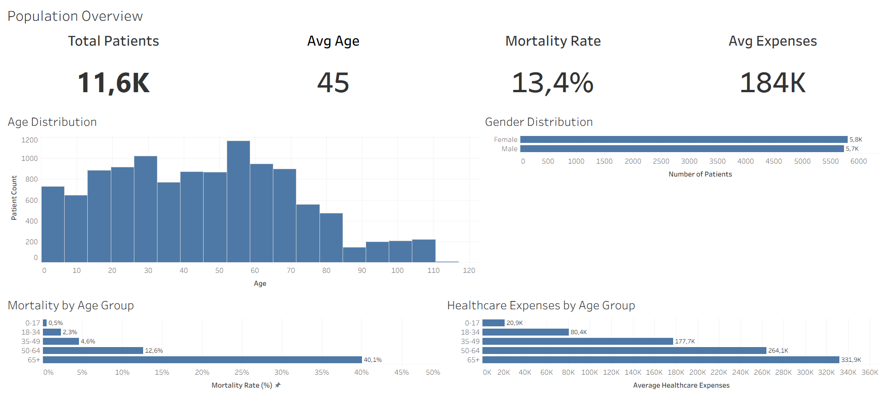
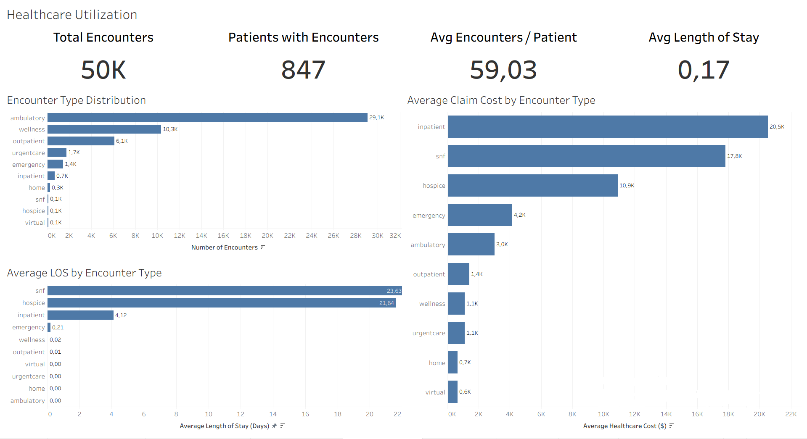
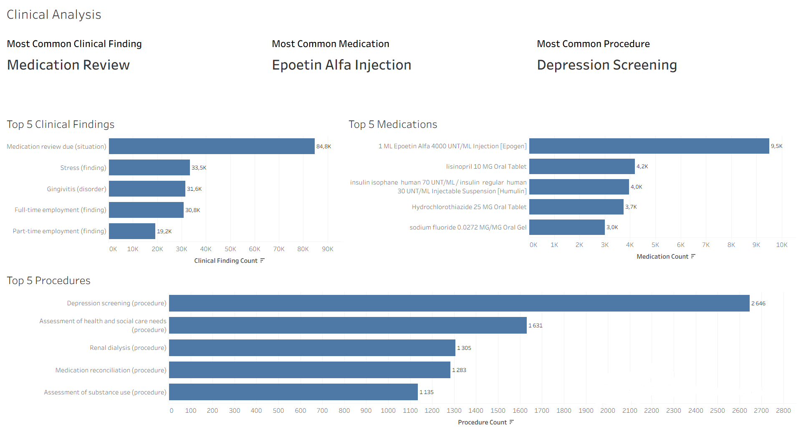
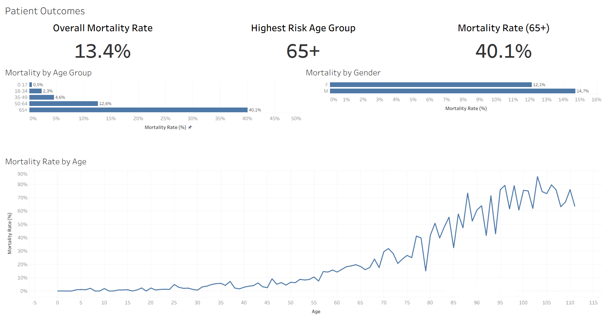

# Healthcare Analytics | End-to-End Data Analytics Project

An end-to-end healthcare analytics project demonstrating the complete analytics lifecycle from synthetic healthcare data generation to business intelligence reporting using Synthea, Google BigQuery, SQL, Python, and Tableau.

## Project Highlights

- Generated synthetic healthcare data using Synthea and Java
- Loaded and transformed data in Google BigQuery
- Performed comprehensive data quality assessment
- Built SQL cleaning and analytics layers
- Conducted exploratory analysis with Python
- Developed 14 business KPIs
- Created 4 interactive Tableau dashboards
- Produced technical documentation and presentation materials

## Table of Contents

## Table of Contents

- #project-overview
- #business-objectives
- #project-architecture
- #dataset
- #technology-stack
- #data-quality-assessment
- #sql-analytics
- #python-exploratory-data-analysis
- #kpi-framework
- #tableau-dashboard-suite
- #key-insights
- #business-recommendations
- #repository-structure
- #skills-demonstrated
- #contact

## Project Overview

This project demonstrates a complete healthcare analytics workflow, beginning with synthetic healthcare data generation and ending with interactive Tableau dashboards and actionable business insights.

The project integrates data engineering, data quality assessment, SQL analytics, exploratory data analysis, KPI development, and business intelligence reporting into a single end-to-end solution.

The dataset was generated using Synthea and processed through Google BigQuery, SQL transformation layers, Python exploratory analysis, and Tableau visualization.

### Project Scope

- Synthetic healthcare data generation using Synthea
- Cloud data storage with Google BigQuery
- Data quality assessment and validation
- SQL-based data cleaning and transformation
- Exploratory data analysis with SQL and Python
- KPI framework development
- Interactive Tableau dashboard development
- Business insight generation and recommendations

## Business Objectives

The project was designed to answer key healthcare analytics questions related to population demographics, healthcare utilization, clinical activity, financial performance, and patient outcomes.

### Business Questions

- What are the demographic characteristics of the patient population?
- How is the population distributed across age groups?
- How do healthcare expenses vary by age?
- Which encounter types generate the highest healthcare utilization?
- Which encounter types generate the highest costs?
- What are the most common clinical findings?
- Which medications are prescribed most frequently?
- Which medical procedures are performed most frequently?
- How does mortality differ by age group?
- How does mortality differ by gender?
- Which population segment presents the highest mortality risk?

## Project Architecture

```text
Synthea (Java)
│
▼
21 Raw Healthcare Tables
│
▼
Python Data Preparation
│
▼
Google BigQuery
│
▼
Data Quality Assessment
│
▼
SQL Cleaning Layer
│
▼
SQL Analytics
│
▼
Python EDA
│
▼
KPI Framework
│
▼
Tableau Dashboards
│
▼
Business Insights
```

## Dataset

### Data Source

The dataset was generated using the open-source healthcare simulation platform Synthea.

Synthea creates realistic synthetic patient records, including demographics, encounters, conditions, medications, procedures, providers, and organizations.

### Dataset Generation

- Generated using Synthea (Java)
- 21 raw healthcare tables created
- Selected datasets loaded into Google BigQuery
- Analytical data model built through SQL transformations

### Analytical Dataset Summary

| Metric                | Value    |
| --------------------- | -------- |
| Patients              | 11,550   |
| Healthcare Encounters | 50,000   |
| Clinical Conditions   | Included |
| Medications           | Included |
| Procedures            | Included |
| Dashboards Developed  | 4        |
| SQL Modules           | 5        |
| Python Notebooks      | 1        |

### Core Analytical Tables

- patients_clean
- encounters_clean
- conditions_clean
- medications_clean
- procedures_clean

## Technology Stack

### Data Engineering

- Synthea
- Java
- Google BigQuery

### Data Processing

- SQL
- BigQuery Views
- Data Validation
- Data Cleaning

### Data Analysis

- Python
- Pandas
- NumPy
- Jupyter Notebook

### Data Visualization

- Tableau Public

### Documentation

- Excel
- PowerPoint
- Markdown

## Data Quality Assessment

Before analytical modeling and dashboard development, a comprehensive data quality assessment was performed.

### Data Quality Checks

#### Completeness

- Missing value assessment
- Critical field validation
- NULL value review

#### Uniqueness

- Primary key validation
- Duplicate detection
- Record uniqueness verification

#### Referential Integrity

- Patient relationship validation
- Cross-table consistency checks
- Join validation across analytical datasets

#### Validity

- Date validation
- Age validation
- Healthcare cost validation
- Business rule verification

### Validation Results

✅ No critical primary key violations detected

✅ No critical duplicate records identified

✅ Referential integrity successfully validated

✅ Business-valid NULL values retained

✅ Dataset approved for SQL, Python, and Tableau analysis

### Quality Outcome

The dataset was determined to be analytically reliable and suitable for dashboard development, KPI reporting, and business insight generation.

## Data Cleaning & Transformation

The raw healthcare dataset was transformed into an analytical layer using Google BigQuery views.

The objective of the cleaning layer was to standardize data structures, improve usability, and prepare the dataset for SQL analysis, Python exploration, and Tableau reporting.

### Transformation Activities

- Renamed technical fields using business-friendly naming conventions
- Standardized analytical keys
- Calculated patient age
- Created Length of Stay (LOS) metric
- Removed invalid date relationships
- Preserved business-valid NULL values
- Built analytical views for reporting

### Clean Analytical Tables

- patients_clean
- encounters_clean
- conditions_clean
- medications_clean
- procedures_clean
- providers_clean
- organizations_clean
- careplans_clean

### Derived Business Fields

#### Age

Calculated from patient birthdate and used throughout demographic analysis.

#### Age Groups

- 0-17
- 18-34
- 35-49
- 50-64
- 65+

Used for population segmentation and mortality analysis.

#### Length of Stay (LOS)

Calculated as the difference between encounter start and end dates.

Used for operational and healthcare utilization analysis.

#### Mortality Indicator

Derived from patient death records and used for outcome analysis.

## SQL Analytics

SQL served as the analytical foundation of the project.

A structured SQL workflow was developed to prepare data, assess quality, perform exploratory analysis, create business KPIs, and generate dashboard-ready datasets.

### SQL Modules

#### HC_01 – Data Quality Assessment

Performed:

- Row count validation
- Missing value analysis
- Duplicate detection
- Referential integrity checks
- Date validation

#### HC_02 – Cleaning Layer

Created analytical views and transformed raw healthcare data into reporting-ready datasets.

#### HC_03 – Exploratory Analysis

Analyzed:

- Patient demographics
- Healthcare utilization
- Clinical activity
- Mortality outcomes
- Healthcare expenses

#### HC_04 – KPI Framework

Designed standardized business metrics for executive reporting.

#### HC_05 – Tableau Dashboard Queries

Generated dashboard-ready datasets and aggregations for Tableau dashboards.

### Key Analytical Areas

- Population Analysis
- Cost Analysis
- Healthcare Utilization
- Clinical Findings
- Medication Analysis
- Procedure Analysis
- Mortality Analysis

## Python Exploratory Data Analysis

Python was used to validate SQL findings, explore healthcare trends, and support dashboard design.

### Tools

- Python
- Pandas
- NumPy
- Matplotlib
- Seaborn
- Jupyter Notebook

### Dataset Used for EDA

To improve notebook performance and simplify exploratory analysis, selected healthcare datasets were reduced and exported for local analysis.

Datasets analyzed included:

- Patients
- Encounters
- Conditions

Analytical sample sizes:

- Patients: 11,550 records
- Encounters: 25,000 records
- Conditions: 50,000 records

### Analysis Areas

#### Demographic Analysis

- Age distribution
- Gender distribution
- Population segmentation

#### Healthcare Cost Analysis

- Expense distribution
- Cost by age group
- Cost variability

#### Healthcare Utilization Analysis

- Encounter volume
- Encounter types
- Length of stay
- Cost by encounter type

#### Clinical Analysis

- Top clinical findings
- Medication patterns
- Procedure patterns

#### Mortality Analysis

- Mortality rate
- Mortality by age group
- Mortality by gender

### Purpose of Python EDA

The Python phase was used to validate findings discovered through SQL analysis and provide additional exploratory insights before dashboard development.

## KPI Framework

The project includes a standardized KPI framework developed through SQL analysis and validated using Python and Tableau.

### Population KPIs

- Total Patients
- Average Age
- Mortality Rate
- Average Healthcare Expenses

### Healthcare Utilization KPIs

- Total Encounters
- Patients with Encounters
- Average Encounters per Patient
- Average Length of Stay (LOS)

### Clinical KPIs

- Most Common Clinical Finding
- Most Common Medication
- Most Common Procedure

### Patient Outcome KPIs

- Overall Mortality Rate
- Highest Risk Age Group
- Mortality Rate (65+)

### KPI Summary

| KPI                         | Value     |
| --------------------------- | --------- |
| Total Patients              | 11.6K     |
| Average Age                 | 45.0      |
| Mortality Rate              | 13.4%     |
| Average Healthcare Expenses | 184K      |
| Total Encounters            | 50K       |
| Average Length of Stay      | 0.17 Days |
| Highest Risk Age Group      | 65+       |
| Mortality Rate (65+)        | 40.1%     |

## Tableau Dashboard Suite

The project includes four interactive Tableau dashboards designed to support healthcare analysis across demographics, utilization, clinical activity, and patient outcomes.

### Dashboard 1 — Population Overview

#### KPIs

- Total Patients
- Average Age
- Mortality Rate
- Average Healthcare Expenses

#### Visualizations

- Age Distribution
- Gender Distribution
- Mortality by Age Group
- Healthcare Expenses by Age Group

---

### Dashboard 2 — Healthcare Utilization

#### KPIs

- Total Encounters
- Active Patients
- Average Encounters per Patient
- Average Length of Stay

#### Visualizations

- Encounter Type Distribution
- Average LOS by Encounter Type
- Average Claim Cost by Encounter Type

---

### Dashboard 3 — Clinical Analysis

#### KPIs

- Most Common Clinical Finding
- Most Common Medication
- Most Common Procedure

#### Visualizations

- Top Clinical Findings
- Top Medications
- Top Procedures

---

### Dashboard 4 — Patient Outcomes

#### KPIs

- Overall Mortality Rate
- Highest Risk Age Group
- Mortality Rate (65+)

#### Visualizations

- Mortality by Age Group
- Mortality by Gender
- Mortality Rate by Age

## Key Insights

### 1. Mortality Increases Significantly After Age 65

Patients aged 65 and older represent the highest-risk population segment.

### 2. Healthcare Expenses Increase With Age

Healthcare spending rises consistently across older age groups.

### 3. Ambulatory Encounters Dominate Healthcare Utilization

The majority of healthcare interactions occur through ambulatory services.

### 4. Inpatient Care Generates the Highest Costs

Inpatient encounters produce the highest average claim costs and longest stays.

### 5. Age Is a Stronger Predictor of Mortality Than Gender

Outcome analysis shows that mortality differences across age groups are substantially greater than differences across genders.

### 6. Clinical Activity Is Concentrated

A relatively small number of findings, medications, and procedures account for the majority of healthcare activity.

## Business Recommendations

Based on the analytical findings, several strategic recommendations were identified:

### Population Health

- Expand preventive care initiatives for senior populations.
- Improve risk monitoring for patients aged 65+.

### Cost Management

- Focus on high-cost inpatient services.
- Identify opportunities to reduce unnecessary hospitalizations.

### Resource Planning

- Align healthcare resources with encounter utilization patterns.
- Improve capacity planning for high-demand services.

### Clinical Operations

- Monitor high-frequency clinical findings and procedures.
- Standardize treatment pathways where appropriate.

### Outcome Management

- Implement age-based risk management strategies.
- Prioritize interventions for high-risk patient segments.

## Repository Structure

```text
Healthcare-Analytics/
│
├── data/
│ ├── patients_clean.csv
│ ├── encounters_clean.csv
│ └── conditions_clean.csv
│
├── documentation/
│ └── Healthcare_Analytics_Documentation.xlsx
│
├── images/
│ ├── dashboard_1_population_overview.png
│ ├── dashboard_2_healthcare_utilization.png
│ ├── dashboard_3_clinical_analysis.png
│ └── dashboard_4_patient_outcomes.png
│
├── presentation/
│ └── Healthcare-Data-Analysis.pptx
│
├── python/
│ ├── create_samples.py
│ └── exploratory_analysis.ipynb
│
├── sql/
│ ├── HC_01_Data_Quality_Assessment.sql
│ ├── HC_02_Cleaning_Layer.sql
│ ├── HC_03_Exploratory_Analysis.sql
│ ├── HC_04_KPI_Framework.sql
│ └── HC_05_Tableau_Dashboard.sql
│
├── tableau/
│ ├── Dashboard_1_Population_Overview/
│ │ └── patients_clean.csv
│ │
│ ├── Dashboard_2_Healthcare_Utilization/
│ │ ├── avg_cost_by_type.csv
│ │ ├── avg_los_by_type.csv
│ │ └── encounter_type_distribution.csv
│ │
│ ├── Dashboard_3_Clinical_Analysis/
│ │ ├── top_conditions.csv
│ │ ├── top_medications.csv
│ │ └── top_procedures.csv
│ │
│ ├── Dashboard_4_Patient_Outcomes/
│ │ ├── mortality_by_age.csv
│ │ └── mortality_by_gender.csv
│ │
│ └── Healthcare_Analytics_Portfolio_Project.twbx
│
└── README.md
```

## Presentation

A project presentation was developed to communicate the analytical workflow, methodology, key findings, and business recommendations.

### Presentation Topics

- Project Overview
- Data Architecture
- Data Quality Assessment
- SQL Transformation Layer
- Exploratory Data Analysis
- KPI Development
- Dashboard Design
- Business Insights
- Project Outcomes

The presentation demonstrates the complete healthcare analytics workflow from raw data generation to business intelligence reporting

## Skills Demonstrated

### Data Engineering

- Synthetic Data Generation
- Data Validation
- Data Quality Assessment
- Data Cleaning
- Data Transformation
- Google BigQuery

### SQL

- Data Profiling
- Exploratory Analysis
- KPI Development
- Analytical Queries
- Business Reporting

### Python

- Data Cleaning
- Exploratory Data Analysis
- Data Visualization
- Statistical Exploration

### Business Intelligence

- Tableau Dashboard Development
- KPI Design
- Data Storytelling
- Interactive Reporting

### Analytics

- Population Analysis
- Healthcare Utilization Analysis
- Clinical Analysis
- Cost Analysis
- Mortality Analysis
- Business Recommendations

## Tableau Dashboard

### Tableau Public

View the interactive dashboard:

https://public.tableau.com/views/HealthcareAnalyticsPortfolioProject/PatientOutcomes

### Dashboard Suite

The project includes four interactive Tableau dashboards covering demographic, operational, clinical, and outcome-focused healthcare analytics.

### Dashboard 1: Population Overview

Analyzes patient demographics, mortality patterns, and healthcare spending.



---

### Dashboard 2: Healthcare Utilization

Evaluates healthcare service usage, encounter patterns, and operational efficiency.



---

### Dashboard 3: Clinical Analysis

Explores clinical findings, medications, and procedures across the patient population.



---

### Dashboard 4: Patient Outcomes

Analyzes mortality patterns and identifies high-risk population segments.



## Project Status

✅ Synthetic Data Generation Completed

✅ Data Quality Assessment Completed

✅ SQL Analytics Completed

✅ Python EDA Completed

✅ KPI Framework Developed

✅ Tableau Dashboard Suite Completed

✅ Technical Documentation Completed

✅ Presentation Completed

✅ Portfolio Project Ready for Review

## Contact

**Denys Dzherin**

Data Analytics Portfolio Project

- LinkedIn: https://www.linkedin.com/in/denys-dzherin-90a6a7418
- GitHub: https://github.com/dzherin-denys
